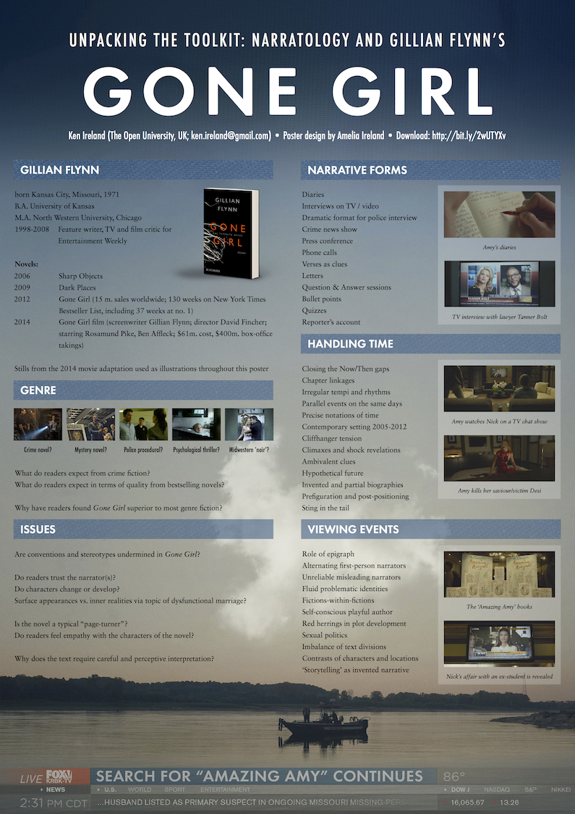

#  Unpacking the Toolkit: Narratology and Gillian Flynn’s *Gone Girl*

Analysis of narratological aspects of *Gone Girl* by Gillian Flynn for [European Narratology Network conference ENN5](http://www.enn5.cz), held in Prague, 13-15 September 2017.

Poster content by KR Ireland, design by @ialarmedalien (A Ireland).

## Downloads

* [Poster with low res images](Gone%20Girl%20Poster-low.pdf) - for viewing on a computer or handheld device
* [Poster with high res images](Gone%20Girl%20Poster.pdf) - suitable for printing at A0 size
